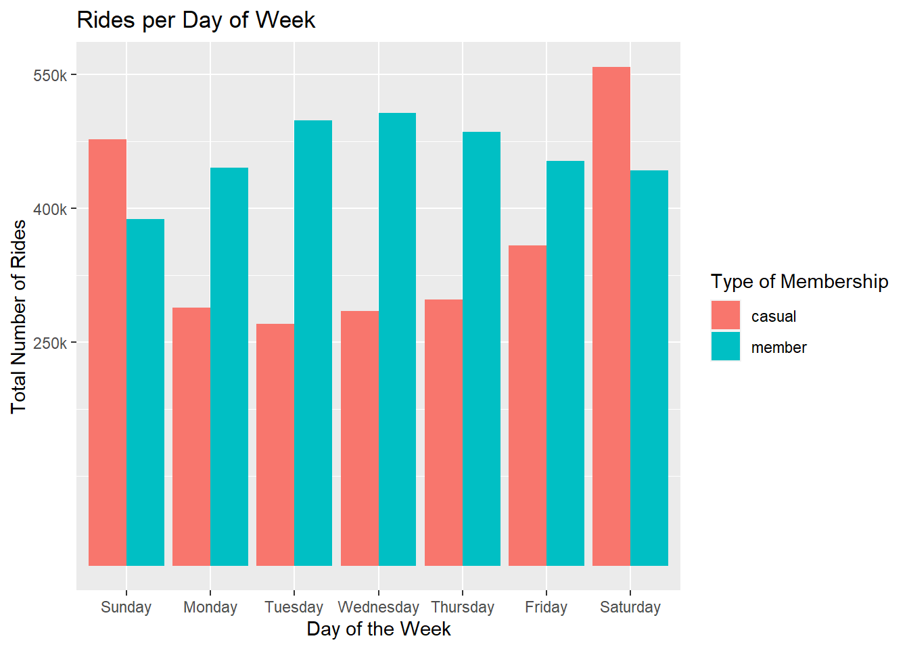
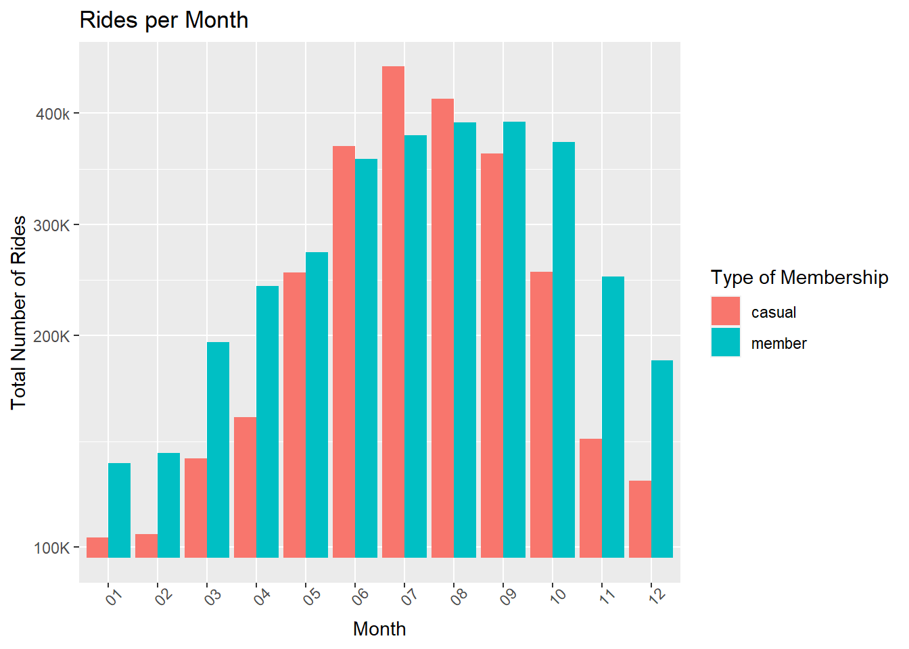
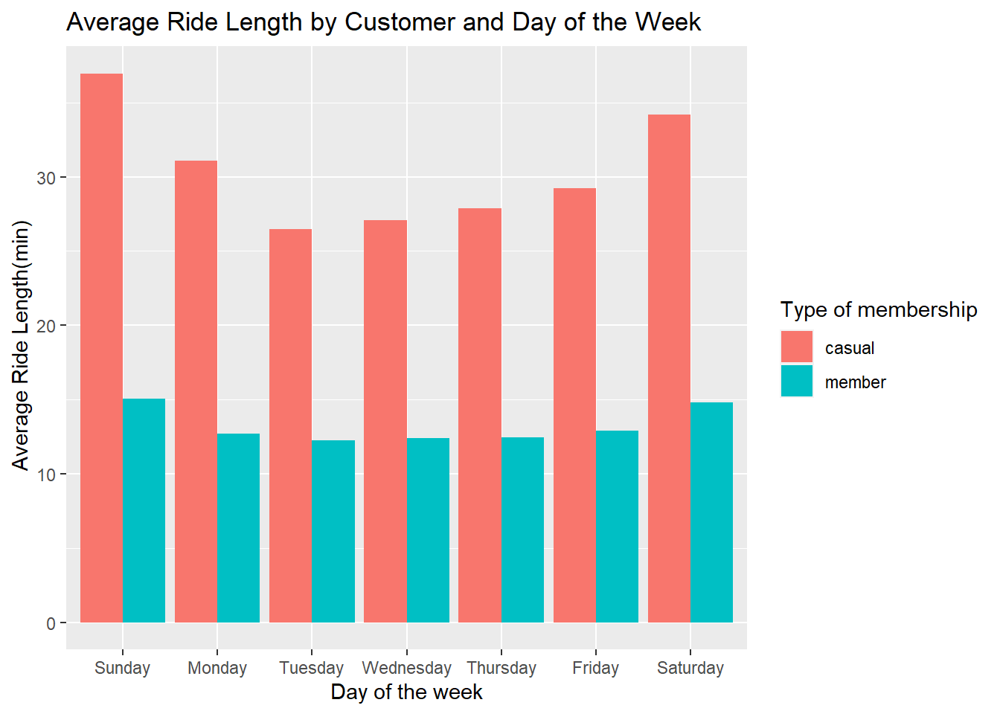
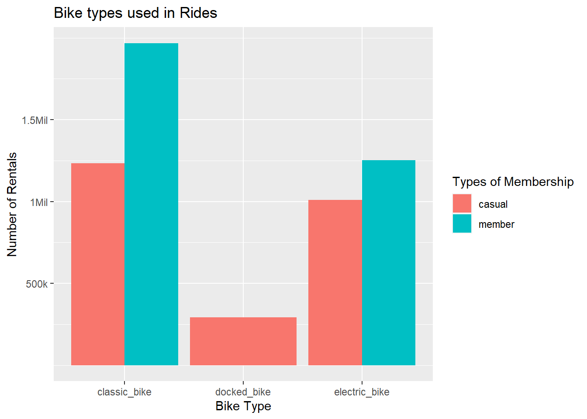
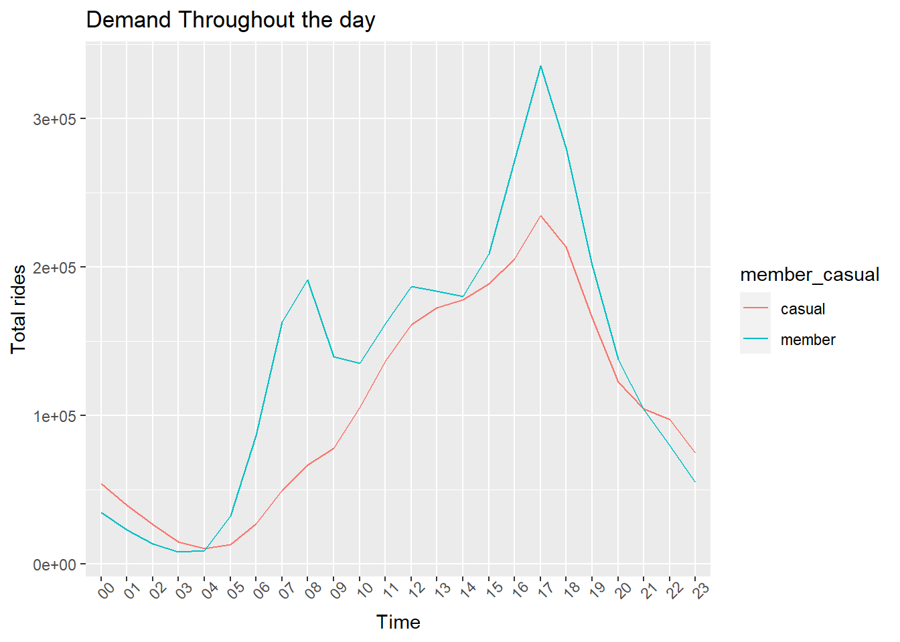

<h1>Data Analysis of fictitious bike sharing company using R with
Tidyverse</h1>

<h4>Understanding the data set.</h4>

Cyclistic is a US based bike sharing company operating mainly in the
Chicago, IL area. Riders can be <strong>Members</strong> (those who pay
annual subscriptions are members) or <strong>Casual</strong>. The
company believes that maximizing annual subscriptions is key to driving
future growth. The data analyst team in Cyclistic has been tasked with
analyzing historical ride data to identify how members and casual riders
use the service differently.

The dataset used is a public dataset located at <a href="https://divvy-tripdata.s3.amazonaws.com/index.html" class="uri">https://divvy-tripdata.s3.amazonaws.com/index.html</a>. It
is provided by Motivate International Inc., under this license - <a href="https://www.divvybikes.com/data-license-agreement" class="uri">https://www.divvybikes.com/data-license-agreement</a> as a
part of the Google Data Analytics Certificate program. 12 months of data
was used for the analysis from May 2021 to April 2022.

<h4>Importing required libraries</h4>
<pre class="r"><code>library(tidyverse)</code></pre>
<pre><code>## ── Attaching packages ─────────────────────────────────────── tidyverse 1.3.1 ──</code></pre>
<pre><code>## ✔ ggplot2 3.3.6     ✔ purrr   0.3.4
## ✔ tibble  3.1.7     ✔ dplyr   1.0.9
## ✔ tidyr   1.2.0     ✔ stringr 1.4.0
## ✔ readr   2.1.2     ✔ forcats 0.5.1</code></pre>
<pre><code>## ── Conflicts ────────────────────────────────────────── tidyverse_conflicts() ──
## ✖ dplyr::filter() masks stats::filter()
## ✖ dplyr::lag()    masks stats::lag()</code></pre>
<pre class="r"><code>library(lubridate)</code></pre>
<pre><code>## 
## Attaching package: &#39;lubridate&#39;</code></pre>
<pre><code>## The following objects are masked from &#39;package:base&#39;:
## 
##     date, intersect, setdiff, union</code></pre>
<pre class="r"><code>getwd()</code></pre>
<pre><code>## [1] &quot;C:/Users/user2/Desktop/Capstone/CaseStudy_Cyclistic/RStudio&quot;</code></pre>
<pre class="r"><code>setwd(&quot;C:/Users/user2/Desktop/Capstone/CaseStudy_Cyclistic/RStudio&quot;)</code></pre>

<h4></h4>

<strong>Acquiring the Input Data Elements</strong>

<pre class="r"><code>#Collect Data
#+++++++++++++
c2021_05 &lt;- read.csv(&quot;202105-divvy-tripdata.csv&quot;)
c2021_06 &lt;- read.csv(&quot;202106-divvy-tripdata.csv&quot;)
c2021_07 &lt;- read.csv(&quot;202107-divvy-tripdata.csv&quot;)
c2021_08 &lt;- read.csv(&quot;202108-divvy-tripdata.csv&quot;)
c2021_09 &lt;- read.csv(&quot;202109-divvy-tripdata.csv&quot;)
c2021_10 &lt;- read.csv(&quot;202110-divvy-tripdata.csv&quot;)
c2021_11 &lt;- read.csv(&quot;202111-divvy-tripdata.csv&quot;)
c2021_12 &lt;- read.csv(&quot;202112-divvy-tripdata.csv&quot;)
c2022_01 &lt;- read.csv(&quot;202201-divvy-tripdata.csv&quot;)
c2022_02 &lt;- read.csv(&quot;202202-divvy-tripdata.csv&quot;)
c2022_03 &lt;- read.csv(&quot;202203-divvy-tripdata.csv&quot;)
c2022_04 &lt;- read.csv(&quot;202204-divvy-tripdata.csv&quot;)</code></pre>

<h4><strong>Data Cleansing and Processing</strong></h4>

Checked if the column names and corresponding data types of the data
set matched.

<pre class="r"><code>areColumnsTheSame &lt;- function(...) {
  first &lt;- NULL
  for (df in list(...)) {
    if (is.null(first)) {
      first &lt;- df
    } else {
      if (!(identical(sapply(df, class), sapply(first, class)))) {
        return(FALSE)
      }
    }
  }
  return(TRUE)
}</code></pre>

Combine the 12 data set into one big data frame.

<pre class="r"><code>Combined_trips &lt;- bind_rows(c2021_05, c2021_06, c2021_07, c2021_08, c2021_09, c2021_10, c2021_11, c2021_12, c2022_01, c2022_02, c2022_03, c2022_04)</code></pre>

Checked the first few rows of the big data set.
Made sure the count of the number of rows created in the new copy is the
same as the combined data sets.

<pre class="r"><code>head(Combined_trips)</code></pre>
<pre><code>##            ride_id rideable_type          started_at            ended_at
## 1 C809ED75D6160B2A electric_bike 2021-05-30 11:58:15 2021-05-30 12:10:39
## 2 DD59FDCE0ACACAF3 electric_bike 2021-05-30 11:29:14 2021-05-30 12:14:09
## 3 0AB83CB88C43EFC2 electric_bike 2021-05-30 14:24:01 2021-05-30 14:25:13
## 4 7881AC6D39110C60 electric_bike 2021-05-30 14:25:51 2021-05-30 14:41:04
## 5 853FA701B4582BAF electric_bike 2021-05-30 18:15:39 2021-05-30 18:22:32
## 6 F5E63DFD96B2A737 electric_bike 2021-05-30 11:33:41 2021-05-30 11:57:17
##   start_station_name start_station_id end_station_name end_station_id start_lat
## 1                                                                         41.90
## 2                                                                         41.88
## 3                                                                         41.92
## 4                                                                         41.92
## 5                                                                         41.94
## 6                                                                         41.88
##   start_lng end_lat end_lng member_casual
## 1    -87.63   41.89  -87.61        casual
## 2    -87.62   41.79  -87.58        casual
## 3    -87.70   41.92  -87.70        casual
## 4    -87.70   41.94  -87.69        casual
## 5    -87.69   41.94  -87.70        casual
## 6    -87.63   41.89  -87.62        casual</code></pre>
<pre class="r"><code>nrow(Combined_trips)</code></pre>
<pre><code>## [1] 5757551</code></pre>

Deleted unwanted columns for the analysis. The Start and End -
(Station name) and (Station ID) are not needed for the analysis.

<pre class="r"><code>Combined_trips_copy &lt;- Combined_trips %&gt;% select(-c(start_station_name, start_station_id, end_station_name, end_station_id ))
head(Combined_trips_copy) </code></pre>
<pre><code>##            ride_id rideable_type          started_at            ended_at
## 1 C809ED75D6160B2A electric_bike 2021-05-30 11:58:15 2021-05-30 12:10:39
## 2 DD59FDCE0ACACAF3 electric_bike 2021-05-30 11:29:14 2021-05-30 12:14:09
## 3 0AB83CB88C43EFC2 electric_bike 2021-05-30 14:24:01 2021-05-30 14:25:13
## 4 7881AC6D39110C60 electric_bike 2021-05-30 14:25:51 2021-05-30 14:41:04
## 5 853FA701B4582BAF electric_bike 2021-05-30 18:15:39 2021-05-30 18:22:32
## 6 F5E63DFD96B2A737 electric_bike 2021-05-30 11:33:41 2021-05-30 11:57:17
##   start_lat start_lng end_lat end_lng member_casual
## 1     41.90    -87.63   41.89  -87.61        casual
## 2     41.88    -87.62   41.79  -87.58        casual
## 3     41.92    -87.70   41.92  -87.70        casual
## 4     41.92    -87.70   41.94  -87.69        casual
## 5     41.94    -87.69   41.94  -87.70        casual
## 6     41.88    -87.63   41.89  -87.62        casual</code></pre>

Verify to confirm if the new data set created has the same number of
rows as the combined data set.

<pre class="r"><code>nrow(Combined_trips_copy)</code></pre>
<pre><code>## [1] 5757551</code></pre>
<pre class="r"><code>dim(Combined_trips_copy)</code></pre>
<pre><code>## [1] 5757551       9</code></pre>

Created new columns in this new data set - date, month, day , year,
day of the week and hour of the trip.

<pre class="r"><code>Combined_trips_copy$date &lt;- as.Date(Combined_trips$started_at)
Combined_trips_copy$month &lt;- format(as.Date(Combined_trips_copy$date), &quot;%m&quot;)
Combined_trips_copy$day &lt;- format(as.Date(Combined_trips_copy$date), &quot;%d&quot;)
Combined_trips_copy$year &lt;- format(as.Date(Combined_trips_copy$date), &quot;%Y&quot;)
Combined_trips_copy$day_of_the_week &lt;- format(as.Date(Combined_trips_copy$date), &quot;%A&quot;)
Combined_trips_copy$started_at &lt;- as_datetime(Combined_trips$started_at)
Combined_trips_copy$ended_at &lt;- as_datetime(Combined_trips$ended_at)
Combined_trips_copy$start_hour &lt;- format(Combined_trips_copy$started_at, &quot;%H&quot;)
head(Combined_trips_copy)</code></pre>
<pre><code>##            ride_id rideable_type          started_at            ended_at
## 1 C809ED75D6160B2A electric_bike 2021-05-30 11:58:15 2021-05-30 12:10:39
## 2 DD59FDCE0ACACAF3 electric_bike 2021-05-30 11:29:14 2021-05-30 12:14:09
## 3 0AB83CB88C43EFC2 electric_bike 2021-05-30 14:24:01 2021-05-30 14:25:13
## 4 7881AC6D39110C60 electric_bike 2021-05-30 14:25:51 2021-05-30 14:41:04
## 5 853FA701B4582BAF electric_bike 2021-05-30 18:15:39 2021-05-30 18:22:32
## 6 F5E63DFD96B2A737 electric_bike 2021-05-30 11:33:41 2021-05-30 11:57:17
##   start_lat start_lng end_lat end_lng member_casual       date month day year
## 1     41.90    -87.63   41.89  -87.61        casual 2021-05-30    05  30 2021
## 2     41.88    -87.62   41.79  -87.58        casual 2021-05-30    05  30 2021
## 3     41.92    -87.70   41.92  -87.70        casual 2021-05-30    05  30 2021
## 4     41.92    -87.70   41.94  -87.69        casual 2021-05-30    05  30 2021
## 5     41.94    -87.69   41.94  -87.70        casual 2021-05-30    05  30 2021
## 6     41.88    -87.63   41.89  -87.62        casual 2021-05-30    05  30 2021
##   day_of_the_week start_hour
## 1          Sunday         11
## 2          Sunday         11
## 3          Sunday         14
## 4          Sunday         14
## 5          Sunday         18
## 6          Sunday         11</code></pre>

Calculated the ride length in secs and also in minutes.

<pre class="r"><code>Combined_trips_copy$ride_length &lt;- difftime(Combined_trips_copy$ended_at, Combined_trips_copy$started_at, units = c(&quot;secs&quot;))

Combined_trips_copy$ride_length_in_mins &lt;- difftime(Combined_trips_copy$ended_at, Combined_trips_copy$started_at, units = c(&quot;mins&quot;))

Combined_trips_copy$ride_length_in_mins_rounded &lt;- round(Combined_trips_copy$ride_length_in_mins, digits = 3)

Combined_trips_copy %&gt;%
  select(ride_id, ride_length_in_mins_rounded) %&gt;%
  head(., 10)</code></pre>
<pre><code>##             ride_id ride_length_in_mins_rounded
## 1  C809ED75D6160B2A                 12.400 mins
## 2  DD59FDCE0ACACAF3                 44.917 mins
## 3  0AB83CB88C43EFC2                  1.200 mins
## 4  7881AC6D39110C60                 15.217 mins
## 5  853FA701B4582BAF                  6.883 mins
## 6  F5E63DFD96B2A737                 23.600 mins
## 7  C884951E36656727                 14.717 mins
## 8  48B60B250FE75AF9                 17.917 mins
## 9  E3D0CC2FE1359880                  2.617 mins
## 10 4382735758ABF2CE                 26.350 mins</code></pre>

Arranging the number of rides by the day.

<pre class="r"><code>Combined_trips_copy %&gt;%

  group_by(day_of_the_week,member_casual) %&gt;%

    summarise(rides = n_distinct(ride_id),

     average_duration &lt;- mean(ride_length_in_mins_rounded)) %&gt;%

  arrange(day_of_the_week)</code></pre>
<pre><code>## `summarise()` has grouped output by &#39;day_of_the_week&#39;. You can override using
## the `.groups` argument.</code></pre>
<pre><code>## # A tibble: 14 × 4
## # Groups:   day_of_the_week [7]
##    day_of_the_week member_casual  rides `average_duration &lt;- mean(ride_length_…`
##    &lt;fct&gt;           &lt;chr&gt;          &lt;int&gt; &lt;drtn&gt;                                  
##  1 Sunday          casual        477032 36.96339 mins                           
##  2 Sunday          member        388042 15.05839 mins                           
##  3 Monday          casual        289029 31.06574 mins                           
##  4 Monday          member        445635 12.71225 mins                           
##  5 Tuesday         casual        270548 26.46369 mins                           
##  6 Tuesday         member        498682 12.25960 mins                           
##  7 Wednesday       casual        284868 27.09257 mins                           
##  8 Wednesday       member        506969 12.41504 mins                           
##  9 Thursday        casual        298061 27.88768 mins                           
## 10 Thursday        member        485843 12.43806 mins                           
## 11 Friday          casual        358203 29.20852 mins                           
## 12 Friday          member        453281 12.87788 mins                           
## 13 Saturday        casual        558617 34.19278 mins                           
## 14 Saturday        member        442741 14.78072 mins</code></pre>

<h4>Data findings with visualizations</h4>

The following visualizations were built to analyze how members and
casual riders use bikes differently. Ride counts and ride lengths were
analyzed by user type as well as, time of the day, month, and day of the week.

Comparing member/casual riders and day of the week.

<pre class="r"><code>Combined_trips_copy %&gt;%
  group_by(member_casual, day_of_the_week) %&gt;%
  summarise(rides = n()) %&gt;%
  arrange (member_casual, day_of_the_week) %&gt;%
  ggplot(aes(x= day_of_the_week, y = rides, fill = member_casual)) + geom_col(position = &quot;dodge&quot;) + 
  labs(x= &#39;Day of the Week&#39;, y=&#39;Total Number of Rides&#39;, title= &#39;Rides by Day of the Week&#39;, fill = &#39;Type of Membership&#39;) +
  scale_y_continuous(breaks = c(250000, 400000, 550000), labels = c(&quot;250k&quot;, &quot;400k&quot;, &quot;550k&quot;))</code></pre>
<pre><code>## `summarise()` has grouped output by &#39;member_casual&#39;. You can override using the
## `.groups` argument.</code></pre>

Comparing members/casual riders and the month of the year. This chart below,
shows how ridership varies across months between casual riders and
members. Casual ridership seems to peak during the summer months while
dropping off significantly in winter. While members’ ridership drops off
during winter as well, the drop is not as steep as for casual
riders.

<pre class="r"><code>Combined_trips_copy %&gt;%
  group_by(member_casual, month) %&gt;%
  summarise(rides = n() , ride_length_in_mins_rounded) %&gt;%
  arrange(member_casual) %&gt;%
  ggplot(aes(x= month, y= rides, fill = member_casual)) + geom_col(position = &quot;dodge&quot;) +
  labs(x =&quot;Month&quot;, y=&quot;Total Number of Rides&quot;,title = &quot;Rides per Month&quot;, fill = &quot;Type of Membership&quot;) +
  scale_y_continuous(breaks = c(10000, 200000, 300000, 400000), labels = c(&quot;100K&quot;, &quot;200K&quot;, &quot;300K&quot;, &quot;400k&quot;)) + theme(axis.text.x = element_text(angle = 45))</code></pre>
<pre><code>## `summarise()` has grouped output by &#39;member_casual&#39;, &#39;month&#39;. You can override
## using the `.groups` argument.</code></pre>

Chart shows the average ride length by customer type and the day of
the week.

<pre class="r"><code>Combined_trips_copy %&gt;%
  group_by(member_casual, day_of_the_week) %&gt;%
  summarise(average_ride_length = mean(ride_length_in_mins_rounded)) %&gt;%
  ggplot(aes(x= day_of_the_week, y= average_ride_length, fill = member_casual)) + geom_col(position = &quot;dodge&quot;) + labs (x= &quot;Day of the week&quot;, y=&quot; Average Ride Length(min)&quot;,  title = &quot;Average Ride Length by Customer and Day of the Week&quot;, fill = &quot;Type of membership&quot;)</code></pre>
<pre><code>## `summarise()` has grouped output by &#39;member_casual&#39;. You can override using the
## `.groups` argument.
## Don&#39;t know how to automatically pick scale for object of type difftime.
## Defaulting to continuous.</code></pre>

Bikes used for the rides. This chart shows the different bikes used
by the riders. It shows the usage of the bikes for the rides.

<pre class="r"><code>Combined_trips_copy %&gt;%
  ggplot(aes(x = rideable_type, fill = member_casual)) + geom_bar( position = &quot;dodge&quot;) + labs (x=&#39;Bike Type&#39;, y= &#39;Number of Rentals&#39;, title = &#39;Bike types used in Rides&#39;, fill = &#39;Types of Membership&#39;) + scale_y_continuous(breaks = c(500000, 1000000, 1500000), labels= c(&quot;500k&quot;, &quot;1Mil&quot;, &quot;1.5Mil&quot;))</code></pre>

Rides by the hour analysis.

<pre class="r"><code>Combined_trips_copy %&gt;%
  group_by(member_casual, start_hour) %&gt;%
  summarise(Total_rides = n()) %&gt;%
  ggplot(aes(x= start_hour, y= Total_rides, color = member_casual, group = member_casual)) + geom_line() + theme(axis.text.x = element_text(angle = 45)) + labs(title = &quot;Demand Throughout the day&quot;, x= &quot;Time&quot;, y=&quot;Total rides&quot;)</code></pre>
<pre><code>## `summarise()` has grouped output by &#39;member_casual&#39;. You can override using the
## `.groups` argument.</code></pre>

<h4>Conclusion</h4>

This Cyclistic Bike trips analysis with R, yielded valuable insights
that the marketing team at Cyclistic can leverage to design their
marketing campaigns. We were able to visualize the data and understand the hours the casual riders use the most. Also we have identified the months there were the most casual users. From the standpoint of the data analysis team, the
following can be potential next steps:

<ul>
<li>
Supporting the marketing team in tracking the effectiveness of
various campaigns
</li>
<li>
Considering ways to improve the current analysis:

<ul>
<li>
Expanding the scope of the analysis from the past 12 months to
even further in the past, which may help uncover longer multi-year
trends
</li>
<li>
Bringing in additional data points like a user identifier (data
can be appropriately de-identified so as to remove any Personally
Identifiable Information), which would enable a variety of interesting
analysis (eg: determining the revenue impact of converting casual users
to members)
</li>
</ul></li>
</ul>

This document provides how the provided data sets was combined as
single data set. The columns not needed were removed and the remaining
columns were used for analysis. The graphs shows the rides at different
times of the day, days of the week and months of a year. Another similar
anlaysis was done using SQL server and Power BI for visualization, it
can be found at <a href="https://github.com/aishupadhu/Cyclistic-SQLServer-PowerBI">aishupadhu/Cyclistic-SQLServer-PowerBI
(github.com)</a>

